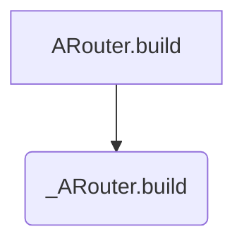

### Postcard 是什么？
Postcard 继承自 RouteMeta，就是一个路由的抽象。

从自动注入开始看
```Java
ARouter.inject(Object object)
```
```Java
    static void inject(Object thiz) {
        AutowiredService autowiredService = 
            ((AutowiredService)ARouter.getInstance().build("/arouter/service/autowired").navigation());
        if (null != autowiredService) {
            autowiredService.autowire(thiz);
        }
    }
```
这是个很好的例子，通过将 `"/arouter/service/autowired"`  传入build 方法中，得到一个 Postcard 对象，然后调用其 `navigation` 方法获取具体对象。追踪看是如何实现的。

```Java
    protected Postcard build(String path) {
        if (TextUtils.isEmpty(path)) {
            throw new HandlerException(Consts.TAG + "Parameter is invalid!");
        } else {
            // 先无视这个
            PathReplaceService pService = ARouter.getInstance().navigation(PathReplaceService.class);
            if (null != pService) {
                path = pService.forString(path);
            }
            return build(path, extractGroup(path));
        }
    }
```
这个期间他又通过ARouter获取了一个 PathReplaceService 对象，可以统一的对所有的路由的路径做处理，这里我们不追踪，之后把整个过程走完一遍再回头看就非常容易了。
这里要看 `extractGroup` 方法
```Java
...
String defaultGroup = path.substring(1, path.indexOf("/", 1));
...
```
代码很简单，就获取已 `/` 为分组的第一个为路由组group，继续看如何生成 Postcard

```Java
    protected Postcard build(String path, String group) {
        if (TextUtils.isEmpty(path) || TextUtils.isEmpty(group)) {
            throw new HandlerException(Consts.TAG + "Parameter is invalid!");
        } else {
            // 先无视这个
            PathReplaceService pService = ARouter.getInstance().navigation(PathReplaceService.class);
            if (null != pService) {
                path = pService.forString(path);
            }
            return new Postcard(path, group);
        }
    }
```
### 总结
假设路由路径为 `"/arouter/service/autowired"`  ，将会生成一个 `Postcard` 对象，并且其的  path 为 `"/arouter/service/autowired"`  group 为 `"arouter"`